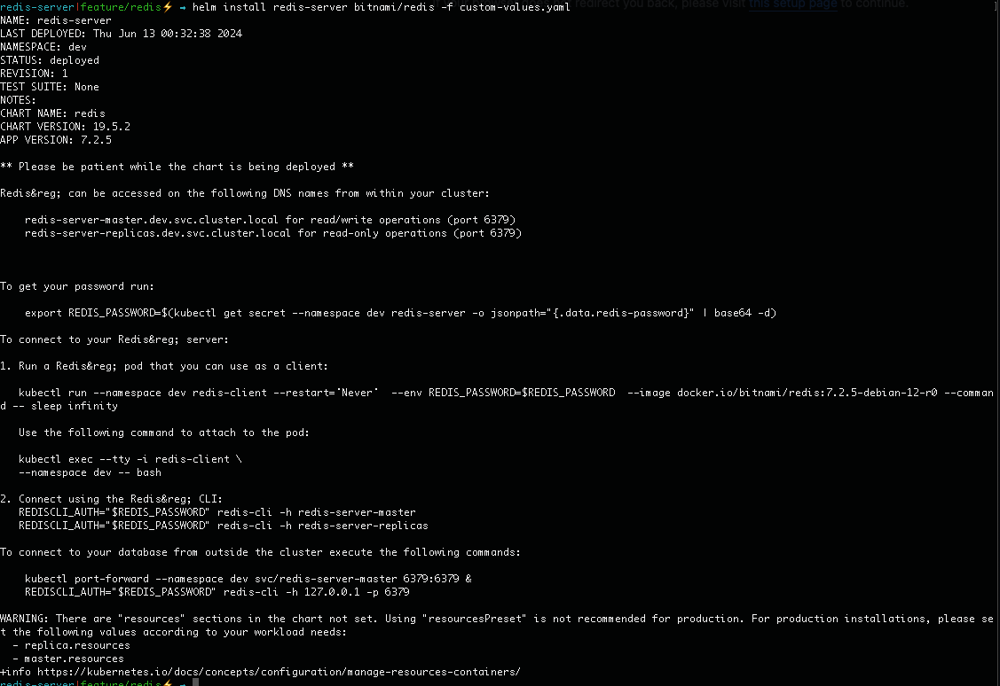

# Redis Install

## Helm and Bitnami

Add the Bitnami Helm chart repository by executing the following command:

```
helm repo add bitnami https://charts.bitnami.com/bitnami
```
Update the Helm chart repositories:

```
helm repo update
```

## Install Helm chart

Install with custom values

```
helm install my-redis bitnami/redis -f custom-values.yaml
```
## Output for a local install

.

Redis&reg; can be accessed on the following DNS names from within your cluster:

    redis-server-master.dev.svc.cluster.local for read/write operations (port 6379)
    redis-server-replicas.dev.svc.cluster.local for read-only operations (port 6379)


To get your password run:

    export REDIS_PASSWORD=$(kubectl get secret --namespace dev redis-server -o jsonpath="{.data.redis-password}" | base64 -d)

To connect to your Redis&reg; server:

1. Run a Redis&reg; pod that you can use as a client:

```
kubectl run --namespace dev redis-client --restart='Never'  --env REDIS_PASSWORD=$REDIS_PASSWORD  --image docker.io/bitnami/redis:7.2.5-debian-12-r0 --command -- sleep infinity
```
   Use the following command to attach to the pod:

```
kubectl exec --tty -i redis-client \
--namespace dev -- bash
````

2. Connect using the Redis&reg; CLI:

```
REDISCLI_AUTH="$REDIS_PASSWORD" redis-cli -h redis-server-master
REDISCLI_AUTH="$REDIS_PASSWORD" redis-cli -h redis-server-replicas
```
To connect to your database from outside the cluster execute the following commands:
```
kubectl port-forward --namespace dev svc/redis-server-master 6379:6379 &
REDISCLI_AUTH="$REDIS_PASSWORD" redis-cli -h 127.0.0.1 -p 6379
```
WARNING: There are "resources" sections in the chart not set. Using "resourcesPreset" is not recommended for production. For production installations, please set the following values according to your workload needs:
  - replica.resources
  - master.resources
+info https://kubernetes.io/docs/concepts/configuration/manage-resources-containers/